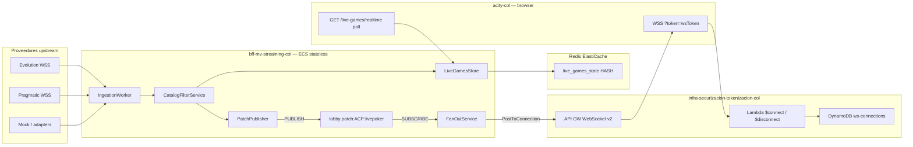

# Cambio arquitectónico — WSS cliente vía API Gateway

**Fecha:** 10 junio 2026  
**Repo:** `bff-mv-streaming-col`  
**Decisión:** Equipo de infraestructura

---

## 1. Entendimiento confirmado

El BFF **deja de exponer WebSocket a navegadores**. El control de conexiones (auth `wsToken`, eviction 1-conexión-por-identidad, Cognito Identity Pool) queda **100 % en API Gateway WebSocket v2** y Lambdas del repo `infra-securizacion-tokenizacion-col`.

El BFF pasa a ser **stateless** respecto a clientes:

1. Conectores upstream (Evolution, Pragmatic, mocks) → adapters → filtro catálogo.
2. **Publica** parches en Redis Pub/Sub (`lobby:patch:{company}:{lobby}`).
3. Actualiza snapshot en `LiveGamesStore` (hash Redis + memoria) para **REST poll**.
4. **FanOutService** (mismo proceso ECS) **suscribe** el canal Redis y hace `PostToConnection` vía `@aws-sdk/client-apigatewaymanagementapi` hacia los `connectionId` registrados en DynamoDB por `$connect`.

La librería `ws` se conserva **solo** para conexiones salientes a proveedores (futuro); no para clientes frontend.

---

## 2. Tabla de archivos

| Acción | Archivo | Notas |
|--------|---------|-------|
| **MODIFICAR** | `src/index.ts` | Elimina `WebSocketServer` cliente; arranca FanOut + PatchPublisher |
| **MODIFICAR** | `src/pubsub/FanOutService.ts` | Suscriptor Redis → API GW Management API / log local |
| **MODIFICAR** | `src/ingestion/IngestionWorker.ts` | `PatchPublisher.publish()` en lugar de `broadcast(wss)` |
| **MODIFICAR** | `src/config/env.ts` | `IS_OFFLINE`, `API_GATEWAY_WS_MANAGEMENT_ENDPOINT`, `REDIS_PATCH_CHANNEL`, etc. |
| **MODIFICAR** | `src/pubsub/RedisClient.ts` | `createRedisSubscriber()` |
| **MODIFICAR** | `.cursorrules` | Sin WSS cliente en prod |
| **MODIFICAR** | `README.md` | Dev: REST + log fan-out; prod: API GW |
| **MODIFICAR** | `.env.example` | Nuevas variables |
| **MODIFICAR** | `package.json` | `@aws-sdk/client-apigatewaymanagementapi` |
| **MODIFICAR** | `tests/unit/fanOutService.test.ts` | Tests modo local |
| **AÑADIR** | `src/pubsub/PatchPublisher.ts` | `PUBLISH` al canal Redis |
| **AÑADIR** | `src/pubsub/ConnectionsRegistry.ts` | Resuelve `connectionId` (env / DynamoDB) |
| **AÑADIR** | `docs/CAMBIO-ARQUITECTONICO-WSS-APIGW.md` | Este documento |
| **REMOVER** | Lógica WSS cliente en `FanOutService` | `handleConnection`, `broadcast` a `wss.clients` |
| **REMOVER** | `WebSocketServer` en `index.ts` | Path `/ws/live-games` ya no existe en BFF |

---

## 3. Diagrama de flujo

---

## 4. Comportamiento local vs producción

| Aspecto | Local (`IS_OFFLINE=true`, default en `development`) | Producción (`IS_OFFLINE=false`) |
|---------|------------------------------------------------------|----------------------------------|
| WSS cliente en BFF | **No** — eliminado | **No** |
| Fan-out a browser | `console.log('[FanOut:local]', …)` si `USE_LOCAL_FANOUT_LOG=true` | `ApiGatewayManagementApi.postToConnection` |
| Redis pub/sub | Opcional; sin Redis → entrega directa in-process al FanOut | Obligatorio ElastiCache |
| REST poll | `GET /api/v1/live-games/realtime` sigue funcionando | Igual |
| Connection IDs | `FANOUT_CONNECTION_IDS=id1,id2` (pruebas) | `CONNECTIONS_TABLE_NAME` → Scan DynamoDB (MVP); futuro: Redis set `lobby:connections:active` |
| Auth WS | N/A en BFF | Lambdas infra en `$connect` |

### Canal Redis

| Constante | Valor |
|-----------|-------|
| Patrón | `lobby:patch:{company}:{lobby}` |
| Ejemplo | `lobby:patch:ACP:livepoker` |
| Env | `REDIS_PATCH_CHANNEL` o derivado de `INGEST_COMPANY` + `INGEST_LOBBY` |

Payload en canal: `RealtimePatchMessage` (`type: "patch"`, `updates[]`) o un solo `LiveGamesTablePatch`.

---

## 5. Qué debe proveer infraestructura

| Recurso | Responsable | Uso en BFF |
|---------|-------------|------------|
| API GW WebSocket v2 + rutas `$connect`/`$disconnect` | Infra | Cliente conecta aquí, no al BFF |
| DynamoDB `ws-connections` (PK `id` = `GUEST#` / `USER#`, attr `connectionId`) | Infra | FanOut lee IDs activos |
| `API_GATEWAY_WS_MANAGEMENT_ENDPOINT` en task ECS | Infra | URL Management API del stage WSS |
| IAM task role: `execute-api:ManageConnections` | Infra | `PostToConnection` |
| Redis ElastiCache accesible desde ECS | Infra | Pub/sub + hash snapshot |
| `CONNECTIONS_TABLE_NAME` en env ECS | Infra | ej. `ws-connections-prod` |

### TODO / mejoras post-MVP

- [ ] Sustituir `Scan` DynamoDB por registry Redis `lobby:connections:active` (opción B).
- [ ] GSI o stream DynamoDB para fan-out dirigido por identidad.
- [ ] Batching 50–100 ms en FanOut antes de `PostToConnection`.
- [ ] `HDEL` en hash snapshot cuando mesa sale del catálogo horario.

---

## 6. Referencias

- `../Analisis-mv/GUIA-MAESTRA-LOBBY-BFF-3-PROYECTOS.md`
- `../Analisis-mv/CHECKLIST-PRE-CODIFICACION-BFF.md` §3 (canal pub/sub)
- `infra-securizacion-tokenizacion-col/infrastructure/websocket.tf`
